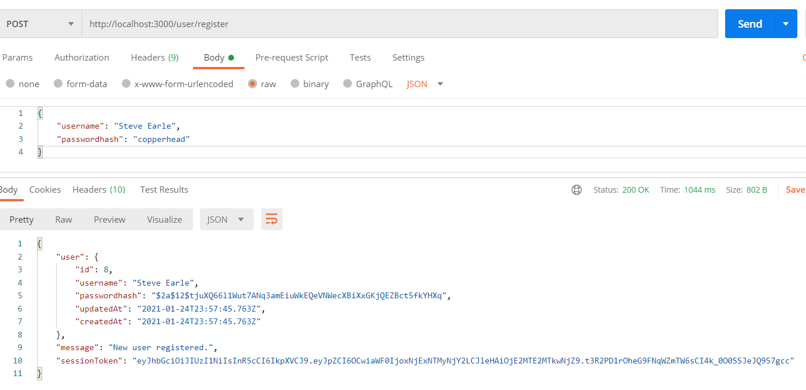
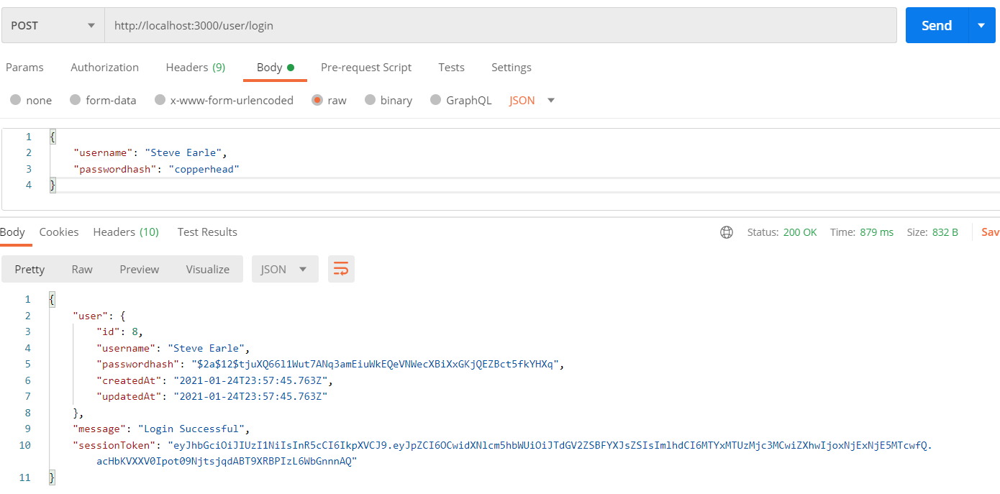
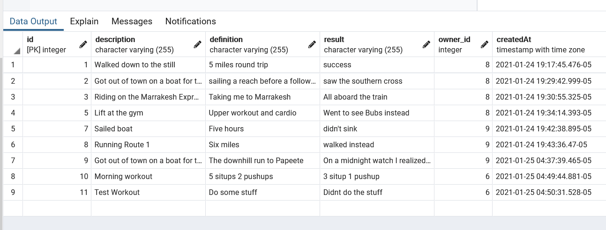

# Workout Log Server

## Elevenfifty Academy Web Dev Blue Badge

### Steve Emerson

### Jan 2021

  

## Endpoints

| Endpoint       | Verb                        | Description                                                                                         |
| :------------- | :-------------------------- | :-------------------------------------------------------------------------------------------------- |
| /user/register | POST                        | Allows a new user to be created with a username and password.                                       |
|                |     |                                                                                                     |
| /user/login    | POST                        | Allows log in with an existing user.                                                                |
|                |        |                                                                                                     |
| /log/          | POST                        | Allows users to create a workout log with descriptions, definitions, results, and owner properties. |
|                |    |                                                                                                     |
| /log/          | GET                         | Gets all logs for an individual user.                                                               |
|                |  |                                                                                                     |
| /log/:id       | GET                         | Gets individual logs by id for an individual user.                                                  |
|                |   |                                                                                                     |
| /log/:id       | PUT                         | Allows individual logs to be updated by a user.                                                     |
|                |    |                                                                                                     |
| /log/:id       | DELETE                      | Allows individual logs to be deleted by a user.                                                     |
|                |    |                                                                                                     |

  

## Data Models

### **user**

| Property     | Type   |
| :----------- | :----- |
| username     | STRING |
| passwordhash | STRING |

 

### **log**

| Property    | Type    |
| :---------- | :------ |
| description | STRING  |
| definition  | STRING  |
| result      | STRING  |
| owner_id    | INTEGER |

